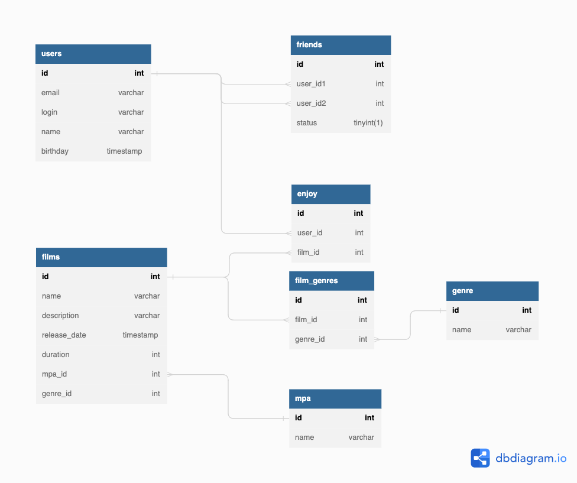

# java-filmorate
Template repository for Filmorate project.

## 1. База данных приложения
Промежуточная была проверена студентом Александром Смсоновым. Коментарии были в pull-request.

Схема базы данных приведена на рисунке 1.1.



Рис. 1.1 - Схема базы данных

### 1.1 Пример запросов к БД

```sql
-- Проверка наличия фильма в БД
SELECT *
FROM films
WHERE name = {name}

-- Фильм с id = {filmId}
SELECT *
FROM films f
WHERE f.id = {filmId}

-- Все фильмы
SELECT *
FROM films

-- Получение жанров фильма с id = {filmId}
SELECT genre_id, g.name FROM film_genres fg
JOIN genre g ON g.id = fg.genre_id
WHERE film_id = {filmId}

-- Получение рейтинга фильма по id = {filmId}
SELECT *
FROM mpa
WHERE film_id = {filmId}
-- Количество лайков у фильма с id = {filmId}
SELECT COUNT(user_id)
FROM enjoy l
WHERE film_id = {filmId}
GROUP BY film_id

-- Топ {N} популярных фильмов
SELECT f.id, f.name, COUNT(e.user_id) number_of_likes
FROM films f
JOIN enjoy e ON f.id = e.film_id
GROUP By f.id
ORDER BY number_of_likes DESC
LIMIT {N}

-- Получение пользователя по его {userId}
SELECT *
FROM users
WHERE id = {userId}

-- Получение друзей пользователя {userId}
SELECT user_id2
FROM friends
WHERE user_id1 = {userId}

-- Общие друзья
SELECT f1.user_id2
FROM friends f1
WHERE f1.user_id1 = {userId1}
AND status = 1
AND f1.user_id2 = (SELECT f2.user_id2
FROM friends f2
WHERE f2.user_id1 = {userId2}
AND status = 1)
```


